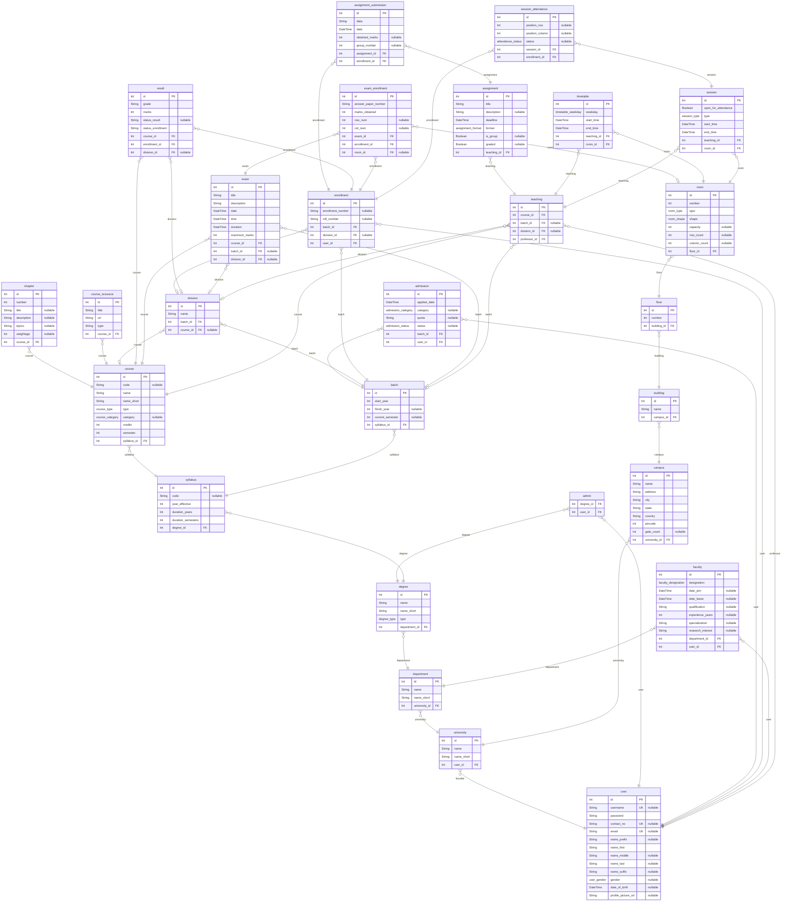

# ER Diagram
> Generated by [`prisma-markdown`](https://github.com/samchon/prisma-markdown)

- [default](#default)

## default

### `university`

**Properties**
  - `id`: 
  - `name`: 
  - `name_short`: 
  - `user_id`: 

### `department`

**Properties**
  - `id`: 
  - `name`: 
  - `name_short`: 
  - `university_id`: 

### `degree`

**Properties**
  - `id`: 
  - `name`: 
  - `name_short`: 
  - `type`: 
  - `department_id`: 

### `admin`

**Properties**
  - `degree_id`: 
  - `user_id`: 

### `assignment`

**Properties**
  - `id`: 
  - `title`: 
  - `description`: 
  - `deadline`: 
  - `format`: 
  - `is_group`: 
  - `graded`: 
  - `teaching_id`: 

### `assignment_submission`

**Properties**
  - `id`: 
  - `data`: 
  - `date`: 
  - `obtained_marks`: 
  - `group_number`: 
  - `assignment_id`: 
  - `enrollment_id`: 

### `syllabus`

**Properties**
  - `id`: 
  - `code`: 
  - `year_effective`: 
  - `duration_years`: 
  - `duration_semesters`: 
  - `degree_id`: 

### `course`

**Properties**
  - `id`: 
  - `code`: 
  - `name`: 
  - `name_short`: 
  - `type`: 
  - `category`: 
  - `credits`: 
  - `semester`: 
  - `syllabus_id`: 

### `chapter`

**Properties**
  - `id`: 
  - `number`: 
  - `title`: 
  - `description`: 
  - `topics`: 
  - `weightage`: 
  - `course_id`: 

### `course_resource`

**Properties**
  - `id`: 
  - `title`: 
  - `url`: 
  - `type`: 
  - `course_id`: 

### `admission`

**Properties**
  - `id`: 
  - `applied_date`: 
  - `category`: 
  - `quota`: 
  - `status`: 
  - `batch_id`: 
  - `user_id`: 

### `batch`

**Properties**
  - `id`: 
  - `start_year`: 
  - `finish_year`: 
  - `current_semester`: 
  - `syllabus_id`: 

### `division`

**Properties**
  - `id`: 
  - `name`: 
  - `batch_id`: 
  - `course_id`: 

### `enrollment`

**Properties**
  - `id`: 
  - `enrollment_number`: 
  - `roll_number`: 
  - `batch_id`: 
  - `division_id`: 
  - `user_id`: 

### `result`

**Properties**
  - `id`: 
  - `grade`: 
  - `marks`: 
  - `status_result`: 
  - `status_enrollment`: 
  - `course_id`: 
  - `enrollment_id`: 
  - `division_id`: 

### `exam`

**Properties**
  - `id`: 
  - `title`: 
  - `description`: 
  - `date`: 
  - `time`: 
  - `duration`: 
  - `maximum_marks`: 
  - `course_id`: 
  - `batch_id`: 
  - `division_id`: 

### `exam_enrollment`

**Properties**
  - `id`: 
  - `answer_paper_number`: 
  - `marks_obtained`: 
  - `row_num`: 
  - `col_num`: 
  - `exam_id`: 
  - `enrollment_id`: 
  - `room_id`: 

### `faculty`

**Properties**
  - `id`: 
  - `designation`: 
  - `date_join`: 
  - `date_leave`: 
  - `qualification`: 
  - `experience_years`: 
  - `specialization`: 
  - `research_interest`: 
  - `department_id`: 
  - `user_id`: 

### `campus`

**Properties**
  - `id`: 
  - `name`: 
  - `address`: 
  - `city`: 
  - `state`: 
  - `country`: 
  - `pincode`: 
  - `gate_count`: 
  - `university_id`: 

### `building`

**Properties**
  - `id`: 
  - `name`: 
  - `campus_id`: 

### `floor`

**Properties**
  - `id`: 
  - `number`: 
  - `building_id`: 

### `room`

**Properties**
  - `id`: 
  - `number`: 
  - `type`: 
  - `shape`: 
  - `capacity`: 
  - `row_count`: 
  - `column_count`: 
  - `floor_id`: 

### `teaching`

**Properties**
  - `id`: 
  - `course_id`: 
  - `batch_id`: 
  - `division_id`: 
  - `professor_id`: 

### `timetable`

**Properties**
  - `id`: 
  - `weekday`: 
  - `start_time`: 
  - `end_time`: 
  - `teaching_id`: 
  - `room_id`: 

### `session`

**Properties**
  - `id`: 
  - `open_for_attendance`: 
  - `type`: 
  - `start_time`: 
  - `end_time`: 
  - `teaching_id`: 
  - `room_id`: 

### `session_attendance`

**Properties**
  - `id`: 
  - `position_row`: 
  - `position_column`: 
  - `status`: 
  - `session_id`: 
  - `enrollment_id`: 

### `user`

**Properties**
  - `id`: 
  - `username`: 
  - `password`: 
  - `contact_no`: 
  - `email`: 
  - `name_prefix`: 
  - `name_first`: 
  - `name_middle`: 
  - `name_last`: 
  - `name_suffix`: 
  - `gender`: 
  - `date_of_birth`: 
  - `profile_picture_url`: 